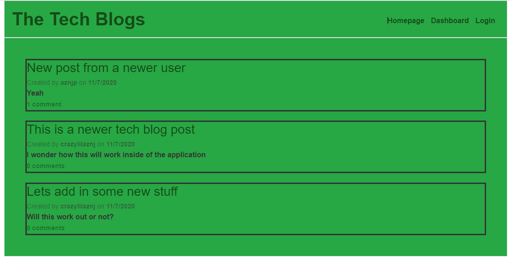
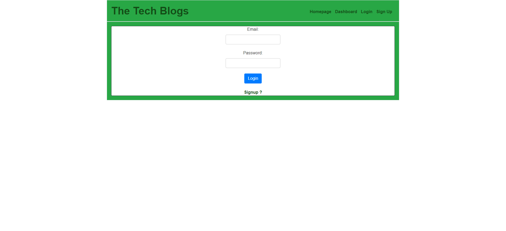
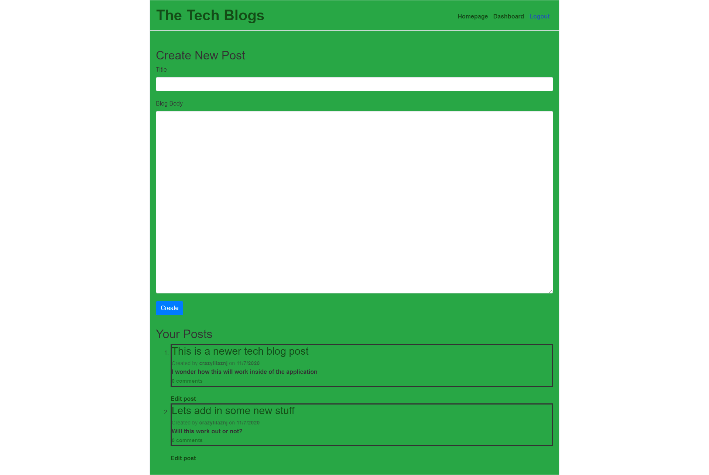
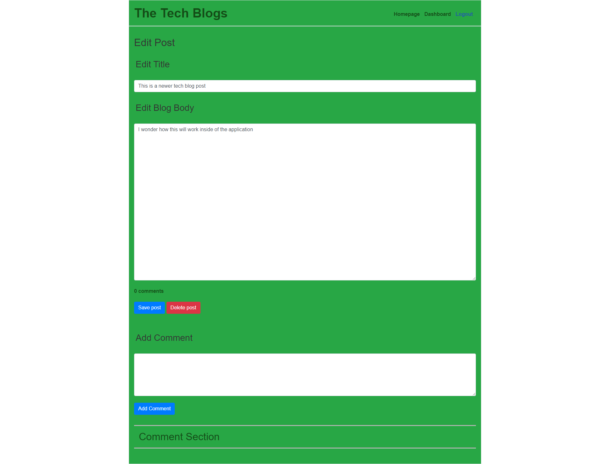
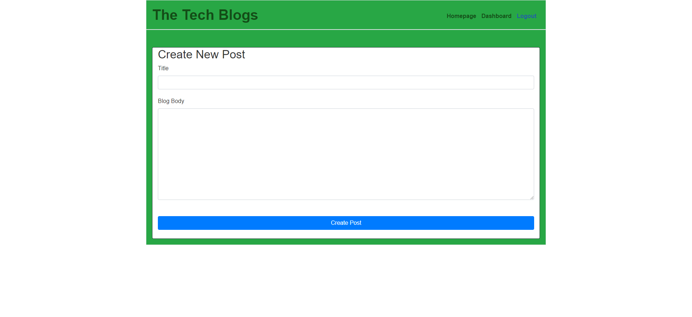
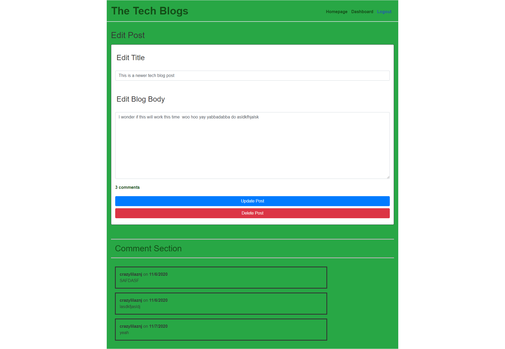
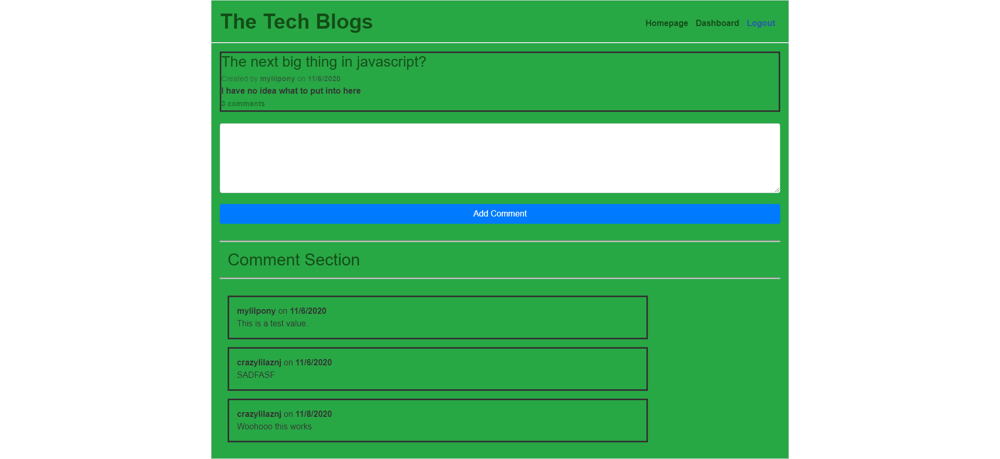

# Tech Blog

## Table of Contents

* [Description](#Description)
* [Usage](#Usage)
* [License](#License)
* [Contributing](#Contributing)
* [Test](#Test)

## Description
As a developer who writes about tech I want a CMS-style blog site so that I can publish articles, blog posts, and my thoughts and opinions. So this app was developed to allow for me and others who are like minded to display their thoughts on new tech, their application and how their opinions on it.

## Usage
The application will begin with a homepage interface that shows all posts that had previously been utilized as shown below.

When you click on any of the nav links the application will lead you to the login page which will allow you to either sign up or login to your account. 

Once you enter you can now enter the dashboard as shown below you are given the option to add a completely new post or edit ones you have previously made.

When you click on any of the other posts (whether they be your own or someone else's) the application will allow you to add in a new comment into the post thereafter.

You can access the application <a href = "https://blog-tech-123.herokuapp.com/">here</a>

## License
MIT  

## Badges

## Contributing
For anyone who wishes to contribute you can contact me with the information below

## Test
The database was checked first by using POST methods to inject NEW USERS into the application first.
Once it has been confirmed that the USERS were added the login form was tested to ensure that each USER would have their own individualised dashboard, comments and posts. Once this was ensured we logged out and logged back in to ensure that it the application would retain the information from the session that was previously done.
    
Would you like to reach us?
 
Contact Me:

Github: https://github.com/aznjp

Email: Jpark103193@gmail.com